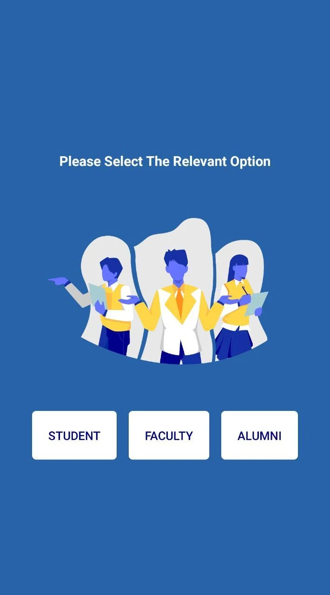
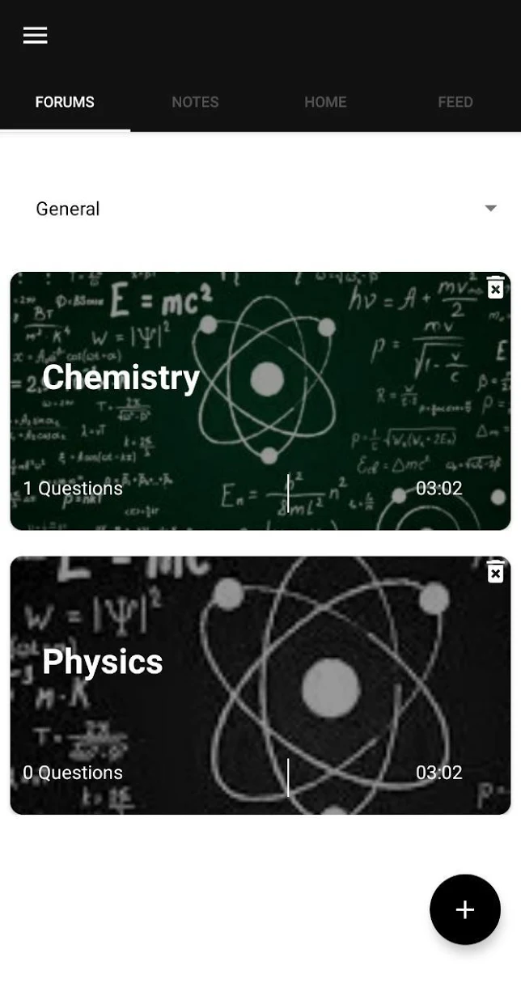
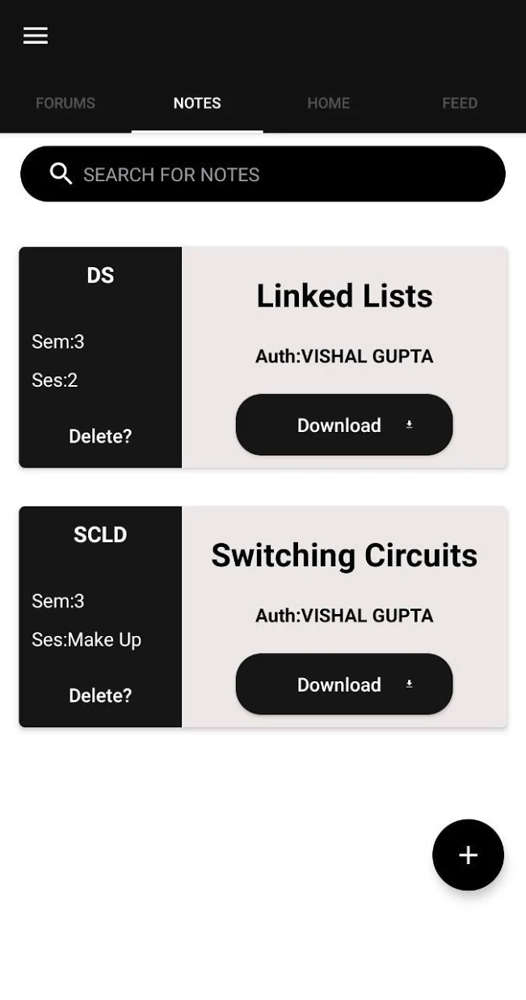

  <h1>Pivot - The Official ICAS App</h1>

  <h3>Features</h3>
  <ul>
  <li>All class notes in one place.</li>
  <li>Active community and forums for all activities in ICAS.</li>
  <li>Connect to Alumni to create a network for flow of information among the community.</li>
  <li>A unique profile for every user, get to know the people of your college</li>
  </ul>
  
  #
  
  

    &nbsp;&nbsp;
    &nbsp;&nbsp;
    
  

  
  #

  ### Download
  You can download the app on the [Play Store](https://play.google.com/store/apps/details?id=com.theenigma.pivot).

