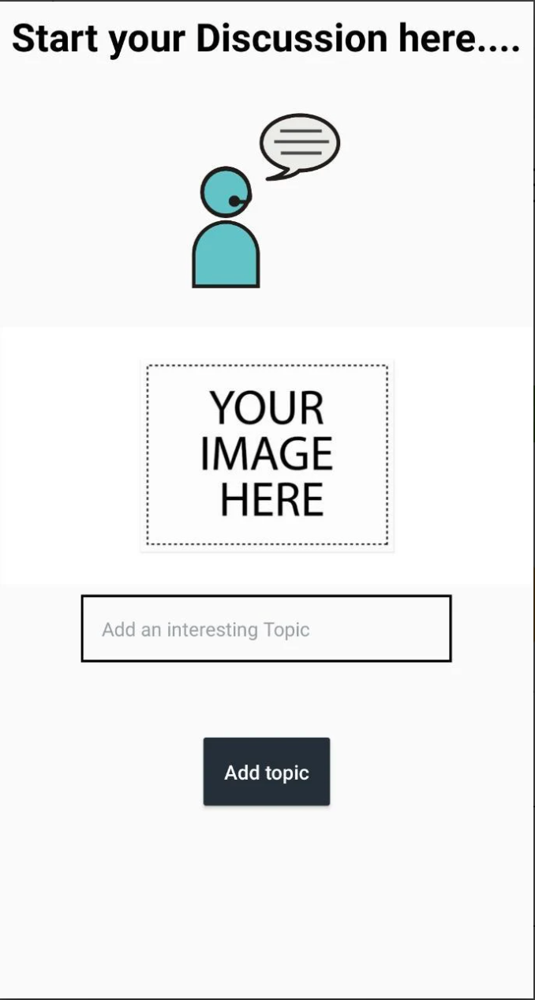

# Pivot - The Official ICAS App

### Features

- All class notes in one place.
- Active community and forums for all activities in ICAS.
- Connect to Alumni to create a network for flow of information among the community.
- A unique profile for every user, get to know the people of your college

### Download
You can download the app on the [Play Store](https://play.google.com/store/apps/details?id=com.theenigma.pivot).
